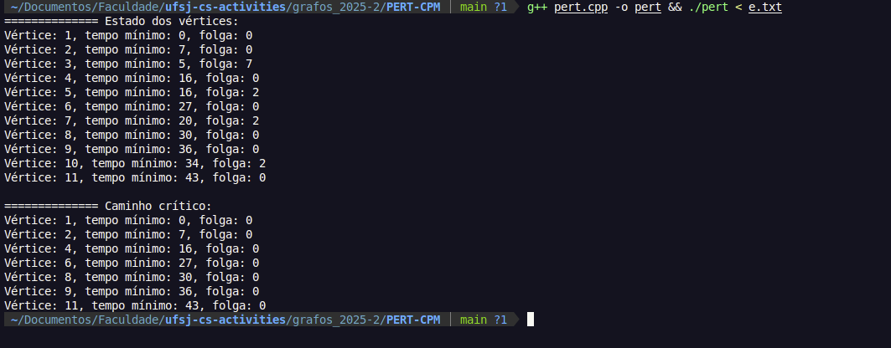

# DOCUMENTATION
This program implements PERT/CPM following most object-oriented practices. The first line of input contains two integers: the number of vertices and the number of edges pertaining to the graph in which PERT/CPM will be applied. The output will consist of all vertices states, followed by the vertices that compose the critical path in index order.

# INPUT
```bash 
11 13
1 2 7
1 3 5
2 4 9
3 5 6
4 5 0
4 6 11
5 7 4
6 8 3
7 8 8
8 9 6
8 10 4
10 9 0
9 11 7
```

# OUTPUT
