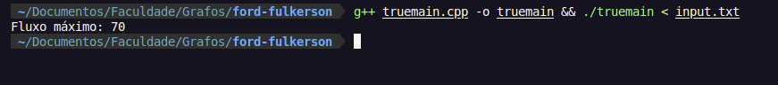

# Ford-Fulkerson algorithm application
This code implements Ford-Fulkerson algorithm with a DFS for finding augmenting paths in a directed graph with source and sink provided.

## How to use
The first two integers must be separated by a whitespace and will define the source and sink vertex respectively. The triples of integers will define edges in which the first integer is the origin, the second the destination, and the third the maximum capacity of that edge. The input must be ended with an End-Of-File. The program will print a single integer representing the maximum flow of the graph.

## Test case
input.txt
```txt
1 6
1 2 50
1 4 40
2 3 60
4 3 70
4 5 60
3 6 30
5 6 50
```
**Output**:
